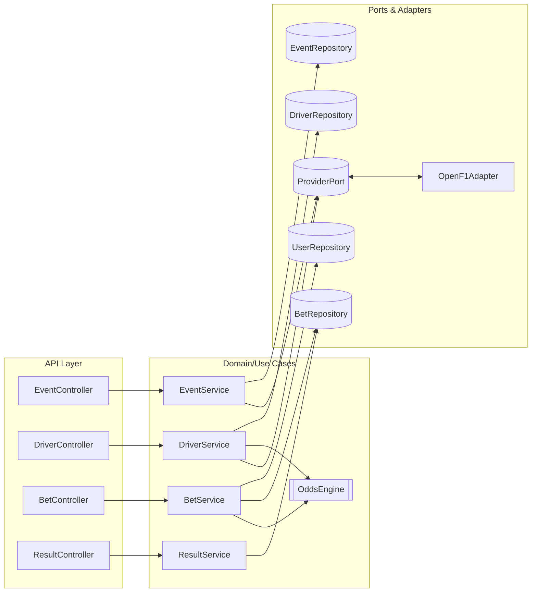

# Sporty F1 Betting Service

Minimal F1 betting microservice. Users can:
1) Discover **events** (e.g., Race/Sprint sessions for a year/country)
2) Fetch **drivers** with **deterministic odds** (values ∈ {2, 3, 4})
3) **Place a bet** on a driver
4) **Settle** an event by declaring the winner; all pending bets are resolved

> **Deterministic Odds:** Computed via a SHA-256 hash derived from `(provider | eventId | driverId)` and mapped to one of **2, 3, 4**. Same input → same odds. No DB row required for odds.

---

## Table of Contents
- [Quick Start](#quick-start)
    - [Run locally (Gradle)](#run-locally-gradle)
    - [Configuration](#configuration)
    - [Verify the service](#verify-the-service)
- [API Reference](#api-reference)
    - [1) List Events](#1-list-events)
    - [2) List Drivers for an Event](#2-list-drivers-for-an-event)
    - [3) Place Driver Bet](#3-place-driver-bet)
    - [4) Settle Event Result](#4-settle-event-result)
- [End-to-End Flow](#end-to-end-flow)
- [High-Level Design (HLD)](#high-level-design-hld)
- [Low-Level Design (LLD)](#low-level-design-lld)
- [Error Handling](#error-handling)
- [Assumptions & Limitations](#assumptions--limitations)
- [Future Enhancements](#future-enhancements)

---

## Quick Start

### Run locally (Gradle)
> Requires JDK 17+ (11+ may work if project is configured). Gradle wrapper is included.

```bash
# 1) Clone
git clone https://github.com/Barun-Kumar/sportyAssignment.git
cd sportyAssignment

# 2) Run
./gradlew bootRun

# Alternatively, build a fat JAR and run
./gradlew clean build
java -jar build/libs/f1bettingService-0.0.1-SNAPSHOT.jar
````
By default, the app starts on http://localhost:8080
.

##Configuration (This is not Rquired to run as of now) 

````
# Server
server.port=8080

# Provider (OpenF1-like)
app.provider.name=openf1
app.provider.base-url=https://api.openf1.org/v1
app.provider.connect-timeout=2000
app.provider.read-timeout=5000
app.provider.cache-ttl-seconds=900

# Odds (deterministic)
app.odds.enabled=true
# Odds engine uses (provider|eventId|driverId) as seed; no secret required.

# Logging
logging.level.root=INFO
logging.level.com.sporty=DEBUG

````
If the app uses in-memory repositories, no DB config is needed.
If using JPA, configure your datasource (H2/Postgres) here and provide DDL/migrations.

##Verify the service
Open a browser or use curl to call the endpoints below.

###API Reference (Base URL: http://localhost:8080)
###1) List Events

```
GET /v1/event
Query: sessionType (e.g., Race), year (e.g., 2025), country (optional), page (0), size (50)

Example
GET /v1/event?sessionType=Race&year=2025

[
  {
    "sessionKey": 9693,
    "meetingKey": 1254,
    "sessionName": "Race",
    "sessionType": "Race",
    "year": 2025,
    "countryName": "Australia",
    "countryCode": "AUS",
    "countryKey": 5,
    "circuitKey": 10,
    "circuitShortName": "Melbourne",
    "location": "Melbourne",
    "dateStart": "2025-03-16T04:00:00+00:00",
    "dateEnd": "2025-03-16T06:00:00+00:00",
    "gmtOffset": "11:00:00"
  },
  {
    "sessionKey": 9998,
    "meetingKey": 1255,
    "sessionName": "Race",
    "sessionType": "Race",
    "year": 2025,
    "countryName": "China",
    "countryCode": "CHN",
    "countryKey": 53,
    "circuitKey": 49,
    "circuitShortName": "Shanghai",
    "location": "Shanghai",
    "dateStart": "2025-03-23T07:00:00+00:00",
    "dateEnd": "2025-03-23T09:00:00+00:00",
    "gmtOffset": "08:00:00"
  }
]

curl "http://localhost:8080/v1/event?sessionType=Race&year=2025"

```

##2) List Drivers for an Event

```
GET /v1/events/{sessionKey}/drivers
Path: sessionKey (e.g., 9998)
GET /v1/events/9998/drivers
curl "http://localhost:8080/v1/events/9998/drivers"

{
  "eventId": "9998",
  "eventName": "Race",
  "location": "Shanghai",
  "country": "CHN",
  "dateStart": "2025-03-23T07:00:00+00:00",
  "dateEnd": "2025-03-23T09:00:00+00:00",
  "drivers": [
    { "providerDriverId": 1,  "name": "Max VERSTAPPEN",   "odd": 3 },
    { "providerDriverId": 4,  "name": "Lando NORRIS",     "odd": 3 },
    { "providerDriverId": 5,  "name": "Gabriel BORTOLETO","odd": 4 },
    { "providerDriverId": 6,  "name": "Isack HADJAR",     "odd": 2 },
    { "providerDriverId": 7,  "name": "Jack DOOHAN",      "odd": 3 },
    { "providerDriverId": 10, "name": "Pierre GASLY",     "odd": 3 },
    { "providerDriverId": 12, "name": "Kimi ANTONELLI",   "odd": 2 },
    { "providerDriverId": 14, "name": "Fernando ALONSO",  "odd": 4 },
    { "providerDriverId": 16, "name": "Charles LECLERC",  "odd": 3 },
    { "providerDriverId": 18, "name": "Lance STROLL",     "odd": 2 },
    { "providerDriverId": 22, "name": "Yuki TSUNODA",     "odd": 3 },
    { "providerDriverId": 23, "name": "Alexander ALBON",  "odd": 4 },
    { "providerDriverId": 27, "name": "Nico HULKENBERG",  "odd": 2 },
    { "providerDriverId": 30, "name": "Liam LAWSON",      "odd": 2 },
    { "providerDriverId": 31, "name": "Esteban OCON",     "odd": 3 },
    { "providerDriverId": 44, "name": "Lewis HAMILTON",   "odd": 4 },
    { "providerDriverId": 55, "name": "Carlos SAINZ",     "odd": 3 },
    { "providerDriverId": 63, "name": "George RUSSELL",   "odd": 2 },
    { "providerDriverId": 81, "name": "Oscar PIASTRI",    "odd": 2 },
    { "providerDriverId": 87, "name": "Oliver BEARMAN",   "odd": 2 }
  ]
}

```


##3) Place Bet on Driver
```
POST /v1/bets/driver

Request Body
{
  "userId": "varun@sporty.test",
  "sessionKey": "9998",
  "providerDriverId": "1",
  "stake": 100.00,
  "odds": 3
}

Sample Response

{
  "betId": "9978d3d1-2878-4e32-b1e9-779ed4a055ba",
  "sessionKey": "9998",
  "providerDriverId": "1",
  "stake": 100.00,
  "odds": 3.00,
  "status": "PENDING",
  "result": null,
  "payout": null,
  "potentialPayout": 300.00,
  "placedAt": "2025-09-05T17:49:27.192076Z",
  "settledAt": null,
  "userId": "varun@sporty.test"
}


```
Validation
stake > 0
odds ∈ {2, 3, 4} and must match server-computed odds for (sessionKey, providerDriverId)
potentialPayout = stake * odds

curl -X POST "http://localhost:8080/v1/bets/driver" \
-H "Content-Type: application/json" \
-d '{"userId":"varun@sporty.test","sessionKey":"9998","providerDriverId":"1","stake":100.00,"odds":3}'

##4) Settle Event Result

```
POST /v1/event/result
Request Body
{
  "sessionKey": "9998",
  "winnerDriverId": "1"
}

Sample Response (array of updated bets)

[
  {
    "betId": "9978d3d1-2878-4e32-b1e9-779ed4a055ba",
    "sessionKey": "9998",
    "providerDriverId": "1",
    "stake": 100.00,
    "odds": 3.00,
    "status": "SETTLED",
    "result": "WIN",
    "payout": 300.00,
    "potentialPayout": 300.00,
    "placedAt": "2025-09-05T17:49:27.192076Z",
    "settledAt": "2025-09-05T17:49:37.266053Z",
    "userId": "varun@sporty.test"
  },
  {
    "betId": "cdb5edc7-cc86-43f3-a160-c5fb49c1a949",
    "sessionKey": "9998",
    "providerDriverId": "1",
    "stake": 100.00,
    "odds": 3.00,
    "status": "SETTLED",
    "result": "WIN",
    "payout": 300.00,
    "potentialPayout": 300.00,
    "placedAt": "2025-09-05T17:49:25.818302Z",
    "settledAt": "2025-09-05T17:49:37.267495Z",
    "userId": "varun@sporty.test"
  },
  {
    "betId": "38ffd196-c2a2-42f2-8f03-0cb273b171b0",
    "sessionKey": "9998",
    "providerDriverId": "1",
    "stake": 100.00,
    "odds": 3.00,
    "status": "SETTLED",
    "result": "WIN",
    "payout": 300.00,
    "potentialPayout": 300.00,
    "placedAt": "2025-09-05T17:49:28.170598Z",
    "settledAt": "2025-09-05T17:49:37.267649Z",
    "userId": "varun@sporty.test"
  }
]

```
Idempotence

Settlement is idempotent by sessionKey—re-settling should not double-credit.

cURL
curl -X POST "http://localhost:8080/v1/event/result" \
-H "Content-Type: application/json" \
-d '{"sessionKey":"9998","winnerDriverId":"1"}'

##End-to-End Flow

sequenceDiagram
autonumber
actor U as User
participant API as API Layer (Spring MVC)
participant ES as EventService
participant DS as DriverService
participant OE as OddsEngine
participant BS as BetService
participant RS as ResultService
participant PR as ProviderAdapter (OpenF1)
participant REPO as Repositories

    U->>API: GET /v1/event?sessionType=Race&year=2025
    API->>ES: findEvents(filters)
    ES->>PR: fetchSessions(filters)
    PR-->>ES: session list
    ES-->>API: events[]
    API-->>U: 200 OK

    U->>API: GET /v1/events/{sessionKey}/drivers
    API->>DS: listDrivers(sessionKey)
    DS->>PR: fetchDrivers(sessionKey)
    PR-->>DS: drivers[]
    DS->>OE: computeOdds(sessionKey, driverId)
    OE-->>DS: {2|3|4}
    DS-->>API: drivers with odds
    API-->>U: 200 OK

    U->>API: POST /v1/bets/driver
    API->>BS: placeBet(req)
    BS->>OE: validateOdds(sessionKey, driverId)
    OE-->>BS: expectedOdds
    BS->>REPO: createBet(PENDING)
    REPO-->>BS: bet
    BS-->>API: bet + potentialPayout
    API-->>U: 201 Created

    U->>API: POST /v1/event/result
    API->>RS: settle(sessionKey, winnerDriverId)
    RS->>REPO: findPendingBets(sessionKey)
    REPO-->>RS: bets[]
    RS->>REPO: update each bet (SETTLED, WIN/LOSE, payout)
    REPO-->>RS: updated bets[]
    RS-->>API: bets[]
    API-->>U: 200 OK


## High-Level Design (HLD)



**Key Points**

* **Hexagonal** style separation of Controllers → Services → Ports/Adapters
* **Provider Adapter** abstracts external OpenF1 API (or a local mock) with caching
* **OddsEngine** is stateless & deterministic
* **Repositories** can be in-memory or JPA-backed; the rest of the app is agnostic

---

## Low-Level Design (LLD)

### Core Models

* `EventDTO`: `sessionKey`, `meetingKey`, `sessionName`, `sessionType`, `year`, `countryName/Code/Key`, `circuitKey`, `circuitShortName`, `location`, `dateStart/End`, `gmtOffset`
* `EventDriversDTO`: `eventId`, meta + `List<DriverOddsDTO>`
* `DriverOddsDTO`: `providerDriverId`, `name`, `odd`
* `Bet`: `betId`, `userId`, `sessionKey`, `providerDriverId`, `stake`, `odds`, `status(PENDING|SETTLED)`, `result(WIN|LOSE|null)`, `potentialPayout`, `payout`, `placedAt`, `settledAt`

> **Money Handling:** Expose decimals in JSON (e.g., `100.00`) but store/compute in **cents** internally where possible to avoid floating-point drift. If decimals are kept, use `BigDecimal` with proper scale and rounding.

### Services (Core Logic)

* **EventService**

    * `findEvents(filters)`: maps provider sessions → `EventDTO` list
* **DriverService**

    * `listDrivers(sessionKey)`: provider drivers + `OddsEngine.computeOdds(...)`
* **BetService**

    * `placeBet(req)`: validate odds & stake → create bet (PENDING) → return with `potentialPayout`
* **ResultService**

    * `settle(sessionKey, winnerDriverId)`: resolve all PENDING bets for session → set status/result → compute `payout`

### OddsEngine (Deterministic)

Pseudo:

```java
int computeOdds(String provider, String eventId, String driverId) {
  String seed = provider + "|" + eventId + "|" + driverId;
  byte[] hash = sha256(seed);
  // Use first 4 bytes as unsigned int
  long v = ((hash[0] & 0xFFL) << 24) | ((hash[1] & 0xFFL) << 16) |
           ((hash[2] & 0xFFL) << 8)  |  (hash[3] & 0xFFL);
  int idx = (int)(v % 3); // 0..2
  int[] bucket = {2,3,4};
  return bucket[idx];
}
```

### Repositories

* `BetRepository`: `save`, `findBySessionKeyAndStatus`, `updateStatusAndPayout`
* `UserRepository` *(if present)*: `find`, `save`, `adjustBalance` (optional if balance is tracked)
* `EventRepository`/`DriverRepository`: cached projections of provider data

### Controllers

* **EventController**: `GET /v1/event`
* **DriverController**: `GET /v1/events/{sessionKey}/drivers`
* **BetController**: `POST /v1/bets/driver`
* **ResultController**: `POST /v1/event/result`

### Validation & Idempotence

* Bean Validation on request DTOs (`@NotNull`, `@Positive`)
* Result settlement idempotent per `sessionKey`

---

## Error Handling

* `400 Bad Request`: invalid stake/odds/sessionKey/driverId
* `404 Not Found`: event/driver not found
* `409 Conflict`: client odds mismatch with server odds
* `422 Unprocessable Entity`: cannot settle (already settled or inconsistent state)
* `500 Internal Server Error`: unhandled errors

Standard error payload:

```json
{ "timestamp": "...", "status": 400, "error": "Bad Request", "message": "<details>", "path": "/v1/bets/driver" }
```

---

## Assumptions & Limitations

* Single market: **Winner (Driver)** per event
* Odds are limited to **2, 3, 4** via deterministic engine
* Authentication/authorization is **not** implemented
* Currency handling: examples show decimals; prefer `BigDecimal` internally or cents
* Provider dependency: if upstream API is down, driver/event fetch may degrade

---


## 2) Architecture (Hexagonal / Clean)

* **API Layer** (Spring controllers / handlers)
* **Application Services** (use-cases):

    * `ListEventsService`
    * `PlaceBetService`
    * `SettleEventService`
    * `GetUserBalanceService`
    * `ListBetsService`
* **Domain**:

    * Entities: `User`, `Bet`, `EventRef`, `Odds`
    * Value Objects: `Money(EUR)`, `Odds(2|3|4)`, `BetStatus(PENDING|WON|LOST)`
* **Ports** (interfaces):

    * `F1ProviderPort` (get sessions, drivers per session)
    * `RandomOddsPort` (2/3/4 generator, deterministic per event+driver)
    * `BetRepository`, `UserRepository`, `LedgerRepository`, `OutcomeRepository`
* **Adapters**:

    * Provider: `OpenF1Adapter` (maps provider fields → domain)
    * Persistence: JPA/SQL (Postgres/MySQL/SQL Server – ANSI SQL where possible)
    * Odds: deterministic PRNG seeded from `(provider, eventKey, driverKey)`
* **Storage**: Relational DB + optional Redis cache for event/session lists.

---


## 5) Persistence Model (ANSI SQL)

```sql
CREATE TABLE users (
  user_id        VARCHAR(64) PRIMARY KEY,
  balance_cents  BIGINT NOT NULL DEFAULT 10000,   -- €100.00
  currency       CHAR(3) NOT NULL DEFAULT 'EUR',
  created_at     TIMESTAMP NOT NULL DEFAULT CURRENT_TIMESTAMP
);

CREATE TABLE providers (
  provider_id SERIAL PRIMARY KEY,
  code        VARCHAR(32) UNIQUE NOT NULL -- e.g., 'OPENF1'
);

CREATE TABLE events (
  event_id           UUID PRIMARY KEY,
  provider           VARCHAR(32) NOT NULL,
  provider_event_id  VARCHAR(64) NOT NULL,
  label              VARCHAR(255) NOT NULL,
  session_type       VARCHAR(32) NOT NULL,
  country            VARCHAR(64),
  scheduled_at       TIMESTAMP,
  UNIQUE(provider, provider_event_id)
);

CREATE TABLE drivers (
  driver_id           UUID PRIMARY KEY,
  provider            VARCHAR(32) NOT NULL,
  provider_driver_id  VARCHAR(64) NOT NULL,
  name                VARCHAR(128) NOT NULL,
  UNIQUE(provider, provider_driver_id)
);

CREATE TABLE bets (
  bet_id        UUID PRIMARY KEY,
  user_id       VARCHAR(64) NOT NULL REFERENCES users(user_id),
  event_id      UUID NOT NULL REFERENCES events(event_id),
  driver_id     UUID NOT NULL REFERENCES drivers(driver_id),
  stake_cents   BIGINT NOT NULL,
  odds          SMALLINT NOT NULL CHECK (odds IN (2,3,4)),
  status        VARCHAR(16) NOT NULL CHECK (status IN ('PENDING','WON','LOST')),
  placed_at     TIMESTAMP NOT NULL DEFAULT CURRENT_TIMESTAMP,
  settled_at    TIMESTAMP NULL
);

CREATE INDEX idx_bets_event_pending ON bets(event_id) WHERE status='PENDING';
CREATE INDEX idx_bets_user ON bets(user_id);

CREATE TABLE outcomes (
  event_id       UUID PRIMARY KEY REFERENCES events(event_id),
  winner_driver  UUID NOT NULL REFERENCES drivers(driver_id),
  settled_at     TIMESTAMP NOT NULL DEFAULT CURRENT_TIMESTAMP
);

CREATE TABLE user_ledger (
  entry_id     BIGSERIAL PRIMARY KEY,
  user_id      VARCHAR(64) NOT NULL,
  amount_cents BIGINT NOT NULL,
  type         VARCHAR(32) NOT NULL, -- DEBIT_BET_PLACED | CREDIT_PAYOUT | ADJUSTMENT
  ref_bet_id   UUID NULL,
  created_at   TIMESTAMP NOT NULL DEFAULT CURRENT_TIMESTAMP
);
```


